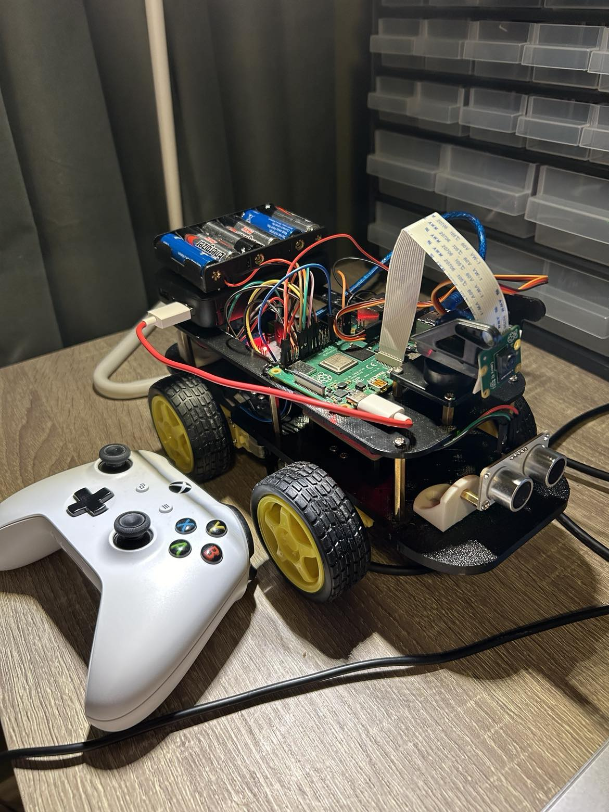

# Robocar


This is a project where I've built
a vehicle that can be controlled with a wireless xbox controller via bluetooth.
It has a camera mounted on a servo that can be turned 90 degrees to both sides.
It also has a distance sensors in the front and the back of the car, and a warning sound will
be set off if the vehicle is too close to any object. The closer the car is 
to an obstacle, the faster the alarm will beep. I've used a serial connection to an arduino
to read data from the distance sensors.

## Prerequisites

### Pairing you XBox controller
Pair your xBox One controller to your raspberry pi according to this [tutorial](https://docs.github.com/en/get-started/writing-on-github/getting-started-with-writing-and-formatting-on-github/basic-writing-and-formatting-syntax).

### Setting up remote connection
1. Enable your VNC connection by first opening the configuration settings
```
sudo raspi config
```
Enable Interface options -> VNC Enable

2. Find your ip adress for your raspberry pi
```
ifconfig
```
Look under wlan0 and find the adress after inet.

3. Download and install [RealVnc](https://www.realvnc.com/en/connect/download/combined/) for your OS.
Use the ip adress you found earlier to connect to your raspberry pi. Your pi needs to
be on the same network as the station you are connecting to it remotely from.

### Downloading necessary libraries
Due to some versions of libraries that might not work
correctly together when installed through pip, we need to use
sudo apt for some of the libraries instead 

```
sudo apt install -y libcamera-apps libcamera-dev libatlas-base-dev python3-kms++ python3-libcamera python3-pyqt5 python3-prctl
sudo apt install -y libhdf5-dev libhdf5-103 libjpeg-dev libjasper-dev

pip3 install picamera2
pip3 install pygame
pip3 install opencv-python
pip3 install pyserial
```

### Setting up pigpio
We need pigpio to control our servo, otherwise
there will be a lot of jitter.
```
sudo apt-get install pigpio 
sudo apt-get install  python-pigpio python3-pigpio
```

Setup pipgio service to run at boot
```
sudo systemctl enable pigpiod
```

Then reboot or start pipgio
```
sudo systemctl start pigpiod
```

### Starting up the program
1. Power your xbox controller and wait for it to connect to the pi
2. Connect to your pi via RealVNC
3. Open this project in a terminal 
4. Run main.py

### Driving and controlling the car
To drive the car:<br />
RT - Gas
LT - Reverse
D-Pad - Turn

If you stand still while turning, the wheels will turn opposite of the
adjacent side to turn faster.

To turn the camera:<br />
Use the RSB stick to turn the camera to the left and right. Letting the stick
go will make the camera go to the neutral position.

To zoom:<br />
Use the LSB stick to zoom in and out. Letting the stick go will set the zoom to
1x.

### Exiting the program
1. When you're finished press Ctrl+C to exit the program safely
2. Power off your xBox controller

### Running tests
To make sure everything is as expected you can run some
tests written to verify the classes in this project. To test
you just have to run the test files.


