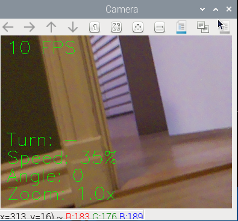

# Robocar

The robocar with Xbox controller
#Todo: add updated picture
<br />
<br />

<br />
Camera feed screenshot from camera onboard robocar

This is a project where I've built
a vehicle that can be controlled with a wireless xbox controller via bluetooth.
It has a camera mounted on a servo that can be turned left and right, and it can be tilted back- and
forward.
It also has a distance sensors in the front and the back of the car, and a warning sound will
be set off if the vehicle is too close to any object. The closer the car is 
to an obstacle, the faster the alarm will beep. 
The front lights will dim according to the external lights, by reading data from a phototransistor.
I've used a serial connection to an arduino to read data from the distance sensors and the
phototransistor.

## Prerequisites

### Pairing you XBox controller
Pair your xBox One controller to your raspberry pi according to this [tutorial](https://docs.github.com/en/get-started/writing-on-github/getting-started-with-writing-and-formatting-on-github/basic-writing-and-formatting-syntax).

### Setting up remote connection
1. Enable your VNC connection by first opening the configuration settings
```
sudo raspi config
```
Enable Interface options -> VNC Enable

2. Find your ip adress for your raspberry pi
```
ifconfig
```
Look under wlan0 and find the adress after inet.

3. Download and install [RealVnc](https://www.realvnc.com/en/connect/download/combined/) for your OS.
Use the ip adress you found earlier to connect to your raspberry pi. Your pi needs to
be on the same network as the station you are connecting to it remotely from.

### Downloading necessary libraries
Due to some versions of libraries that might not work
correctly together when installed through pip, we need to use
sudo apt for some of the libraries instead 

```
sudo apt install -y libcamera-apps libcamera-dev libatlas-base-dev python3-kms++ python3-libcamera python3-pyqt5 python3-prctl
sudo apt install -y libhdf5-dev libhdf5-103 libjpeg-dev libjasper-dev

pip3 install picamera2
pip3 install pygame
pip3 install opencv-python
pip3 install pyserial
```

### Setting up pigpio
We need pigpio to control our servo, otherwise
there will be a lot of jitter.
```
sudo apt-get install pigpio 
sudo apt-get install  python-pigpio python3-pigpio
```

Setup pipgio service to run at boot
```
sudo systemctl enable pigpiod
```

Then reboot or start pipgio
```
sudo systemctl start pigpiod
```

### Upload code to arduino
1. Connect the Arduino Uno to your computer via USB cable
2. Download and install [Arduino IDE](https://www.arduino.cc/en/software).
3. Open the Arduino IDE
4. Go to files and open SerialComm.ino from this project
5. Under Tools -> Boards choose Arduino Uno
6. Under Tools -> Port choose the port that has Arduino Uno in paranthesis in the name
7. Press the upload button
8. Disconnect the Arduino Uno from the PC

### Add changes to config file if necessary
All user tweaking will be done in the config file. Here you can add or remove
components installed on the car, change pin numbers and other limit values for the car
1. Turn off any components you have not added to the car under Components.enabled
2. Change any pin connections that are deviating from the wiring list given below
3. Add or remove progressive lights if need be

## Starting up the program
1. Power your xbox controller and wait for it to connect to the pi
2. Connect to your pi via RealVNC
3. Open this project in a terminal 
4. Run main.py

## Driving and controlling the car
To drive the car:<br />
RT - Gas
LT - Reverse
D-Pad - Turn

If you stand still while turning, the wheels will turn opposite of the
adjacent side to turn faster.

To turn the camera:<br />
Use the RSB stick to turn the camera to the left and right. Letting the stick
go will make the camera go to the neutral position.

To zoom:<br />
Use the LSB stick to zoom in and out. Letting the stick go will set the zoom to
1x.

### Exiting the program
1. When you're finished press Ctrl+C or double tap the specified controller exit button to exit the program in a controlled manner
2. Power off your xBox controller

### Running tests
To make sure everything is as expected you can run some
tests written to verify the classes in this project. To test
you just have to run the test files.

## Appendix

### Wiring
#### Raspberry Pi to L289
22 -> IN2 <br />
18 -> IN1 <br />
16 -> IN4 <br />
15 -> IN3 <br />
11 -> ENA <br />
13 -> ENB <br /> 
GND -> GND

#### Raspberry pi to horizontal servo
37 -> SignalWire <br />
3.3V -> + <br />
GND -> -

#### Raspberry pi to vertical servo
33 -> SignalWire <br />
3.3V -> + <br />
GND -> -

#### Raspberry pi to camera
Cameraslot -> Camera

#### Raspberry pi to arduino
USB-A -> USB-B

#### Raspberry pi to passive buzzer
29 -> +
GND -> -

#### Raspberry pi to LEDs
LED 1<br />
36 -> +
GND -> -
<br />
LED 2<br />
31 -> +
GND -> -

#### L289 to motors
L289 right and left should be based on looking at the
l289 from above reading the text. <br /> 

L289 MOTORA Left -> Right motor front + <br /> 
L289 MOTORA Left -> Right motor back + <br /> 
L289 MOTORA Right -> Right motor back - <br /> 
L289 MOTORA Right -> Right motor front - <br /> 

L289 MOTORB Right -> Left motor front + <br /> 
L289 MOTORB Right -> Left motor back + <br /> 
L289 MOTORB Left -> Left motor back - <br /> 
L289 MOTORB Left -> Left motor front - <br />

#### L289 to batterypack
L289 VMS -> Batterypack +-<br />
L289 GND -> Batterypack -

#### Arduino to front distance sensor
A2 -> Echo <br />
A3 -> Trig <br />
5V -> + <br />
GND -> -

#### Arduino to back distance sensor
A0 -> Echo <br />
A1 -> Trig <br />
5V -> + <br />
GND -> -

#### Arduino to phototransistor


### Parts list

#### Car handling
Battery pack holding 6AA batteries <br />
4 TT motors <br />
L289N motor driver <br />
4 wheels that attach to motors <br />

#### Sensors
2 HC-SR04 distance sensors <br />
Photoresistor

#### Other electrical components
Raspberry Pi 4 model B <br />
Raspberry pi Camera Module V2 <br />
Powerbank 10000mah <br />
Arduino Uno <br />
Arduino Sensor Shield V5.0 <br />
2 SG90 servos <br />
Passive buzzer <br />
Breadboard <br />
2 yellow LED lights <br />
1 10K Ohm resistor <br />
2 220 Ohm resistor

#### Structural components
3D printed parts <br />
6x M3 40 mm spacers <br />
12x M3 10 mm spacers <br />
4 metal brackets for motors <br />
#TODO: write down number of screws
#TODO: write down number of nuts
#TODO: write down number of female to female wires
#TODO: write down number of male to female wires


